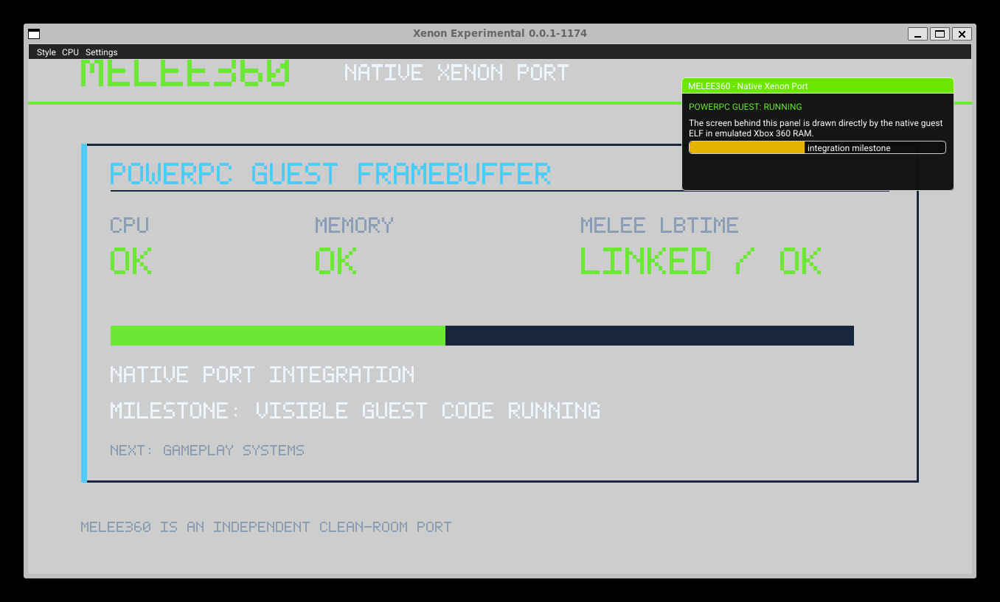

<div align="center">

# MELEE360

### Experimental native port of Super Smash Bros. Melee to Xbox 360

**PowerPC · LibXenon · Xenos · XeLL**

[Status](docs/STATUS.md) · [Architecture](docs/PORTING_ANALYSIS.md) · [XeLL guide](docs/XELL_USB.md) · [XEX path](docs/XEX_BUILD.md)

</div>

> [!IMPORTANT]
> MELEE360 is an early community porting project. It now has a **playable
> native XEX technology demo**, but it is not yet a playable Melee port and
> does not contain Nintendo game data.

## About

MELEE360 explores a native Xbox 360 port of the reconstructed Super Smash
Bros. Melee codebase. It uses
[`999sian/melee-pc`](https://github.com/999sian/melee-pc) as its primary game
code reference and targets homebrew-capable consoles running XeLL Reloaded.

This is a source port, not GameCube emulation. Game logic is compiled for the
Xbox 360 PowerPC CPU while GameCube services are replaced incrementally with
LibXenon implementations.

## Progress

| Area | Status |
|---|---|
| Xbox 360 cross-toolchain | ✅ Working |
| PowerPC ELF generation | ✅ Working |
| Xenos framebuffer and triangle | ✅ Compiled; hardware test pending |
| Xbox 360 controller input | ✅ Compiled |
| Basic PCM audio | ✅ Compiled |
| FAT filesystem and `GALE01` detection | ✅ Compiled |
| GameCube FST and resource lookup | ✅ Host-tested and linked |
| Dolphin `DVDOpen`/`DVDRead` compatibility | ✅ Minimal synchronous slice working |
| HAL `.dat` archive parser and relocation | ✅ Title archive linked and host-validated |
| First reconstructed module (`lbtime.c`) | ✅ Linked and self-tested |
| Original HSD controller pipeline (`controller.c`) | ✅ XInput bridge, normalized sticks and edge-triggered buttons running in XEX |
| Original math/segment test (`lb_00CE.c`) | ✅ PowerPC hit-volume test drives prototype attacks |
| Xenon emulator direct-ELF execution | ✅ Native guest framebuffer and PowerPC milestone running |
| XDK `default.xex` generation | ✅ PowerPC/D3D9 interactive prototype builds and passes `imagexex /DUMP` |
| D3D9 shader/quads renderer | ✅ Runtime-batched 2D geometry with vertex/pixel shaders, gradients and alpha blending |
| Textured sprite atlas | ✅ Runtime-generated legal placeholder art with UV sampling and transparency |
| External graphics resources | ✅ D3DX9 loads `game:\assets\sprite_atlas.png` with an in-memory fallback |
| Native movement/jump/attack sandbox | ✅ Running in Xenia Canary with controller and keyboard input |
| Melee menus and gameplay | 🚧 Not implemented yet |

The current `xenon.elf` is a platform and integration test. With a legal
`GALE01` image on the USB drive it now opens `GmTtAll.dat`, runs the original
HAL archive parser, applies its relocation table and resolves the first public
title-screen resource.

## Architecture

```text
melee-pc reconstructed game code
              │
              ▼
   Dolphin/Aurora compatibility boundary
              │
              ▼
       MELEE360 platform API
              │
       ┌──────┼──────┐
       ▼      ▼      ▼
     Xenos  LibXenon  XeLL
     video   I/O      loader
```

Desktop launcher, WebGPU, SDL, RmlUi and updater components are excluded from
the console runtime. The long-term renderer replaces GX/WebGPU presentation
with a native Xenos backend.

## Build

Requirements: Windows with WSL or Linux, Docker, and Git.

```bash
./tools/setup_xenon.sh --check
./tools/build_x360.sh
```

The official `free60/libxenon` container produces:

```text
dist/xenon.elf
```

An emulator-safe integration ELF can also be built and run with the patched,
pinned Xenon research emulator:

```bash
./tools/setup_xenon_emulator.sh
./tools/build_xenon_emulator_elf.sh
./tools/run_xenon_emulator.sh
```

This verifies native PowerPC execution, memory, endian behavior, linked Melee
code and a status screen written by the guest ELF into tiled Xbox 360
framebuffer memory. It is an integration milestone, not gameplay yet.



For the separate XDK/Xenia route, run `./tools/check_xdk.ps1` from PowerShell
followed by `./tools/build_xex.ps1`, then see the
[XEX build notes](docs/XEX_BUILD.md). SDK files are never copied into this
repository.

The XEX renderer compiles its HLSL shaders with the installed XDK and batches
the complete 2D scene into native `D3DPT_QUADLIST` geometry. Generated shader
microcode stays inside the ignored build directory.

## Run with XeLL

1. Format a USB drive as FAT32.
2. Copy `dist/xenon.elf` to its root as `xenon.elf`.
3. Connect it to an RGH/JTAG Xbox 360.
4. Start XeLL Reloaded.

For optional disc detection, place your own legally obtained image at:

```text
USB:/Melee360/melee.iso
```

See the [complete XeLL guide](docs/XELL_USB.md) for expected output and
troubleshooting.

## Layout

```text
src/common/          Platform-independent boundary
src/xbox360/         LibXenon/Xenos implementation
tests/xbox360/       Native integration test
patches/             Reproducible third-party patches
tools/               Setup and build scripts
docs/                Architecture and progress notes
```

## Legal notice

This repository contains no game ISO, extracted assets, Nintendo source code,
console NAND, key vault, firmware or encryption keys. You must provide your
own legally obtained game copy where required.

Super Smash Bros., Melee, Nintendo and related names are trademarks of their
respective owners. This project is unaffiliated with and not endorsed by
Nintendo.

## Credits

- [`999sian/melee-pc`](https://github.com/999sian/melee-pc)
- [`doldecomp/melee`](https://github.com/doldecomp/melee)
- [`Free60Project/libxenon`](https://github.com/Free60Project/libxenon)
- XeLL Reloaded and the Xbox 360 homebrew community

---

<div align="center">Built carefully, one subsystem at a time.</div>
